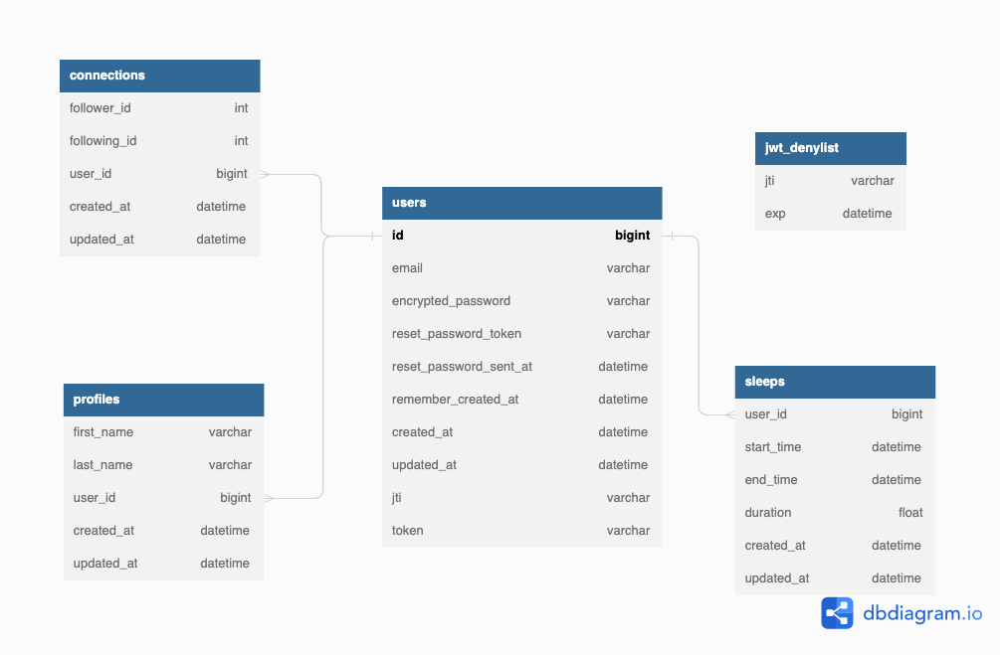

# README

## Table of Contents

- [Original Instructions](#original-instructions)
- [Business Requirements](#busines-requirements-based-on-the-current-instruction)
  - [Project Description](#project-description)
  - [Technical Requirements](#technical-requirements)
- [Software Design Document (SDD)](#software-design-document)
  - [Introduction](#introduction)
  - [Application Logic](#application-logic)
    - [User Stories](#user-stories)
  - [API](#api)
    - [API Endpoints](#api-endpoints)
    - [Sample API endpoints](#sample-api-endpoints)
  - [Database Design](#database-design)
    - [Database Tables](#database-tables)
    - [Database Diagram](#database-diagram)

## Original Instructions

We would like you to implement a “good night” application to let users track when they go to bed and when they wake up. Please use "Ruby on Rails" for this project:

We require some restful APIS to achieve the following:

1. Clock In operation, and return all clocked-in times, ordered by created time.
2. Users can follow and unfollow other users.
3. See the sleep records over the past week for their friends, ordered by the length of their sleep.

Please implement the model, db migrations, and JSON API.
You can assume that there are only two fields on the users “id” and “name”.

You do not need to implement any user registration API.

You can use any gems you like.

## Busines Requirements based on the current instruction.

### title: **Good Aight App**

### Project Description:

We want to build a "good night" application that allows users to track their sleep patterns. The application will be built using the Ruby on Rails framework. We require RESTful APIs that can perform the following operations:

1. **Clock In operation:** Users should be able to clock in and out of their sleep cycles. When they clock out, the application should calculate the length of the sleep cycle and store it in the database. The application should also return all clocked-in times, ordered by created time.
2. **Follow and unfollow other users:** Users should be able to follow and unfollow other users. The application should store the following relationship between the two users.
3. **Sleep records over the past week:** Users should be able to view the sleep records of their friends over the past week, ordered by the length of their sleep. The application should return a list of sleep records that contain the start time, end time, and length of sleep, as well as the name of the user who slept during that period. The application should only return sleep records for users who the requester is following.

### Technical Requirements:

The following are the technical requirements for the application:

1. **Model:** The application should have two models: User and SleepRecord. The user should have two fields: id and name. SleepRecord should have five fields: id, user_id, start_time, end_time, and length_of_sleep.
2. **Database Migrations:** The application should use database migrations to create the User and SleepRecord tables in the database.
3. **JSON API:** The application should provide a RESTful JSON API that allows users to perform the required operations.
4. **Security:** The application should be secure and only allow authenticated users to access the API. Users should only be able to access their own data or the data of users they are following.

## Software Design Document

### Introduction

The "Good Night App" is an application designed to help users track their sleep patterns. It is built using the Ruby on Rails framework and utilizes RESTful APIs for various operations. The main focus of the app is to provide users with a tool that allows them to clock in and out of their sleep cycles, follow and unfollow other users, and view the sleep records of their friends over the past week.

The application has two primary models, User and SleepRecord, and uses database migrations to create the required tables in the database. It offers a secure and user-friendly interface so that users can easily navigate its features and functionalities.

One of the main features of the app is the clock-in operation, which enables users to start and end their sleep cycles. Once a user clocks out, the app calculates the length of the sleep cycle and stores it in the database. It then displays all clocked-in times, ordered by created time, for users to observe their sleep patterns over time.

Another feature of the app is the follow and unfollow function. This allows users to connect with others and view their sleep records, by storing the relationship between the two users.

The sleep records feature lets users view their friends' sleep records from the past week. The app returns a list of sleep records containing the start time, end time, and length of sleep, as well as the name of the user who slept during that period. It ensures the privacy and security of users' data by only displaying sleep records for users who the requester is following.

### Application Logic:

In this Section, we provide an overview of the core functionality and flow of the application, detailing how the system should behave from a user's perspective. This section helps developers, testers, and stakeholders understand the purpose and functionality of the application, ensuring alignment with project goals and requirements.

#### User Stories

| User Role | As a...         | I want to...                 | So that I can...                                 | Acceptance Criteria                                                  |
| --------- | --------------- | ---------------------------- | ------------------------------------------------ | -------------------------------------------------------------------- |
| User      | Registered user | Register and authenticate    | Access the app's features                        | User is registered, logged in, and receives an authentication token  |
| User      | Registered user | Create and update my profile | Personalize my account                           | Profile is linked to the user and can be updated                     |
| User      | Registered user | Clock-in and clock-out       | Record my sleep cycles                           | Sleep records are saved with start time, end time, and duration      |
| User      | Registered user | Follow and unfollow friends  | Connect with others and view their sleep records | Can view sleep records of mutual connections only                    |
| User      | Registered user | View my sleep records        | Observe my sleep patterns over time              | Sleep records are displayed in a list ordered by created time        |
| User      | Registered user | View friends' sleep records  | Compare and learn from others' sleep patterns    | Can view sleep records of mutual connections from the past week only |

Based on the database schema, the application consists of five main tables: connections, jwt_denylist, profiles, sleeps, and users. The user stories are designed around these tables and their relationships:

1. **User Authentication:** Users can register, log in, and authenticate themselves to access the app's features. The users table stores user credentials, while the jwt_denylist table is used for managing JSON Web Tokens (JWT) for secure authentication.

2. **User Profiles:** Registered users can create and update their profiles, which are stored in the profiles table. Profiles are linked to users through a foreign key relationship.

3. **Sleep Records: Users** can clock-in and clock-out to record their sleep cycles. The sleeps table stores these records, which include start time, end time, and duration, and are linked to users through a foreign key relationship.

4. **Follow and Unfollow:** Users can follow and unfollow friends, enabling them to view their friends' sleep records. The connections table stores the relationship between follower and following users, with unique index constraints to prevent duplicate connections.

5. **View Sleep Records:** Users can view their sleep records and the sleep records of their followed friends. The application retrieves sleep records from the sleeps table and filters them based on the connections table.

#### API:

In this Section, we provide an overview of the RESTful API endpoints that correspond to the functionality outlined in the User Stories. These endpoints are based on the given routes defined in the Ruby on Rails application.

##### API Endpoints

| HTTP Method | Endpoint                    | Anchor Tag                      | Description                            |
| ----------- | --------------------------- | ------------------------------- | -------------------------------------- |
| GET         | /                           |                                 | Home index (not part of API)           |
| POST        | /api/v1/users/signup        | [signup](#signup)               | Sign up (register) a new user          |
| POST        | /api/v1/users/sign_in       | [sign-in](#sign-in)             | Sign in (login) an existing user       |
| DELETE      | /api/v1/users/sign_out      | [sign-out](#sign-out)           | Sign out (logout) the current user     |
| GET         | /api/v1/users/:id           | [get-user](#get-user)           | Retrieve a specific user's information |
| PUT         | /api/v1/users/:id           | [update-user](#update-user)     | Update a specific user's information   |
| POST        | /api/v1/users/:id/follow    | [follow-user](#follow-user)     | Follow another user                    |
| DELETE      | /api/v1/users/:id/unfollow  | [unfollow-user](#unfollow-user) | Unfollow another user                  |
| POST        | /api/v1/users/:id/clock_in  | [clock-in](#clock-in)           | Clock-in sleep for the user            |
| POST        | /api/v1/users/:id/clock_out | [clock-out](#clock-out)         | Clock-out sleep for the user           |

These API endpoints allow the GoodNight App to interact with the server and perform the required operations. The anchor tags provide a convenient way to navigate the documentation and quickly access specific sections related to each endpoint. The endpoint paths are still displayed to ensure clarity. The endpoints are designed to provide a consistent and user-friendly interface to access and manage the data stored in the database. The HTTP methods follow the RESTful convention, ensuring a clear separation of responsibilities for each action.

##### Sample API endpoints

Here are the sample code snippets for each endpoint using cards instead of a table format. Please note that you need to replace the placeholders with your actual values, such as `<API_URL>`, `<AUTH_TOKEN>`, `<USER_ID>`, `<FOLLOW_USER_ID>`.

###### Signup

###### Sign in

###### Sign out

###### GET User

```bash
GET /api/v1/users/:id
curl -X GET "<API_URL>/api/v1/users/<USER_ID>" \
  -H "Content-Type: application/json" \
  -H "Authorization: Bearer <AUTH_TOKEN>"

# Success Response:
# HTTP Status: 200 OK
{
  "email": "user@example.com",
  "full_name": "John Doe",
  "followers_count": 10,
  "following_count": 5,
  "followers": [...],
  "followings": [...]
}

# Error Response:
# HTTP Status: 404 Not Found
{
  "success": false,
  "error": "User not found."
}

```

###### Update User

###### Follow User

###### Unfollow User

###### Clock in

###### Clock out

### Database Design

In this Section, we provide an overview of the database tables, their attributes, and relationships based on the given schema. The schema is designed to support the features and functionalities outlined in the User Stories and API Sections.

#### Database Tables

| Table Name | Attribute              | Type     | Constraints      | Relationships |
| ---------- | ---------------------- | -------- | ---------------- | ------------- |
| users      | id                     | bigint   |                  |               |
|            | email                  | string   | unique, not null |               |
|            | encrypted_password     | string   | not null         |               |
|            | reset_password_token   | string   | unique           |               |
|            | reset_password_sent_at | datetime |                  |               |
|            | remember_created_at    | datetime |                  |               |
|            | created_at             | datetime | not null         |               |
|            | updated_at             | datetime | not null         |               |
|            | jti                    | string   |                  |               |
|            | token                  | string   |                  |               |

| Table Name | Attribute  | Type     | Constraints | Relationships                 |
| ---------- | ---------- | -------- | ----------- | ----------------------------- |
| profiles   | id         | bigint   |             |                               |
|            | first_name | string   |             |                               |
|            | last_name  | string   |             |                               |
|            | user_id    | bigint   | not null    | Foreign key: user_id -> users |
|            | created_at | datetime | not null    |                               |
|            | updated_at | datetime | not null    |                               |

| Table Name | Attribute  | Type     | Constraints | Relationships                 |
| ---------- | ---------- | -------- | ----------- | ----------------------------- |
| sleeps     | id         | bigint   |             |                               |
|            | user_id    | bigint   | not null    | Foreign key: user_id -> users |
|            | start_time | datetime |             |                               |
|            | end_time   | datetime |             |                               |
|            | duration   | float    |             |                               |
|            | created_at | datetime | not null    |                               |
|            | updated_at | datetime | not null    |                               |

| Table Name  | Attribute    | Type     | Constraints | Relationships |
| ----------- | ------------ | -------- | ----------- | ------------- |
| connections | id           | bigint   |             |               |
|             | follower_id  | integer  |             |               |
|             | following_id | integer  |             |               |
|             | created_at   | datetime | not null    |               |
|             | updated_at   | datetime | not null    |               |

| Table Name   | Attribute | Type     | Constraints | Relationships |
| ------------ | --------- | -------- | ----------- | ------------- |
| jwt_denylist | id        | bigint   |             |               |
|              | jti       | string   | not null    |               |
|              | exp       | datetime | not null    |               |

#### Database Diagram



These database tables store the necessary data to support the features and functionalities of the GoodNight App. The relationships between the tables ensure data integrity and consistency, while the unique constraints and foreign key relationships promote a well-structured and efficient database design.
